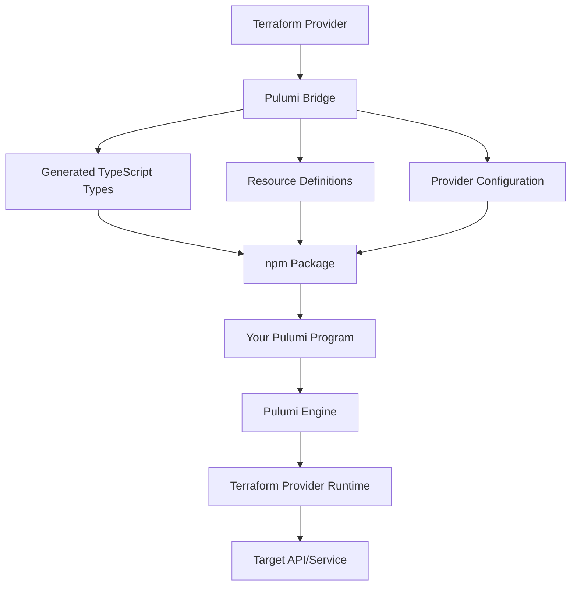
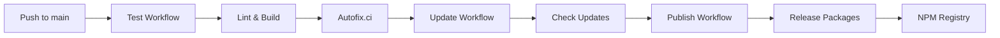

# Architecture

This guide explains how Pulumi Any Terraform works internally, how the bridge operates, and the technical design decisions behind the project.

## Overview

Pulumi Any Terraform is a **dynamic bridge** that automatically converts Terraform providers into native Pulumi providers. This is achieved through Pulumi's [`pulumi-terraform-bridge`](https://github.com/pulumi/pulumi-terraform-bridge), which translates Terraform's schema and resources into Pulumi's type system.

## How It Works



### The Bridge Process

1. **Terraform Provider Schema**: Each Terraform provider defines its resources, data sources, and configuration in Go code with schemas.

2. **Bridge Configuration**: The bridge reads the provider's schema and generates corresponding Pulumi resources.

3. **Type Generation**: TypeScript type definitions are automatically generated, providing full IntelliSense and type safety.

4. **Resource Mapping**: Terraform resources are mapped to Pulumi custom resources with appropriate CRUD operations.

5. **Runtime Execution**: When you run `pulumi up`, the Pulumi engine invokes the bridged provider, which in turn calls the original Terraform provider.

## Project Structure

```
pulumi-any-terraform/
├── packages/                    # Individual provider packages
│   ├── better-uptime/          # Better Uptime provider
│   │   ├── bin/                # Compiled output
│   │   ├── index.ts            # Main exports
│   │   ├── types/              # Type definitions
│   │   ├── config/             # Provider configuration
│   │   ├── package.json        # Package metadata
│   │   └── README.md           # Provider documentation
│   ├── namecheap/              # Namecheap provider
│   └── ...                     # Other providers
├── tools/                       # Build system plugins
│   ├── build.ts                # Build orchestration
│   ├── linter.ts               # Linting plugin
│   ├── prettier.ts             # Code formatting
│   └── syncpack.ts             # Dependency sync
├── docs/                        # Documentation site (Next.js)
├── .github/                     # CI/CD workflows
│   └── workflows/
│       ├── publish.yml         # Package publishing
│       ├── test.yml            # Testing & linting
│       └── update.yml          # Dependency updates
├── nx.json                     # Nx workspace config
├── pnpm-workspace.yaml         # PNPM workspace
└── package.json                # Root configuration
```

## Provider Package Structure

Each provider package follows a consistent structure:

```typescript
// Generated index.ts
import * as pulumi from "@pulumi/pulumi";
import * as utilities from "./utilities";

// Provider configuration
export class Provider extends pulumi.ProviderResource {
    // ...
}

// Resources
export class SomeResource extends pulumi.CustomResource {
    // Properties with full type definitions
    public readonly someProperty!: pulumi.Output<string>;
    
    // Constructor
    constructor(name: string, args: SomeResourceArgs, opts?: pulumi.CustomResourceOptions) {
        // ...
    }
}

// Type definitions
export interface SomeResourceArgs {
    someProperty: pulumi.Input<string>;
    // ...
}
```

### Key Components

#### 1. Provider Resource
Each package exports a `Provider` resource that configures the Terraform provider:

```typescript
const provider = new Provider("my-provider", {
    apiKey: config.requireSecret("apiKey"),
    endpoint: "https://api.example.com",
});
```

#### 2. Custom Resources
Resources are wrapped as Pulumi `CustomResource` classes with:
- Full TypeScript types
- Input/output properties
- Proper lifecycle management
- State tracking

#### 3. Type Definitions
All inputs and outputs are strongly typed:

```typescript
export interface MonitorArgs {
    url: pulumi.Input<string>;
    checkFrequency?: pulumi.Input<number>;
    monitorType: pulumi.Input<"status" | "ping" | "keyword">;
}

export interface MonitorState {
    id: pulumi.Output<string>;
    createdAt: pulumi.Output<string>;
    status: pulumi.Output<string>;
}
```

## Parameterization

Each provider uses **parameterization** to specify which Terraform provider to bridge. This is stored as a base64-encoded value in `package.json`:

```json
{
  "pulumi": {
    "resource": true,
    "name": "terraform-provider",
    "version": "0.14.0",
    "parameterization": {
      "name": "namecheap",
      "version": "2.2.0",
      "value": "eyJyZW1vdGUiOnsidXJsIjoicmVnaXN0cnkub3BlbnRvZnUub3JnL25hbWVjaGVhcC9uYW1lY2hlYXAiLCJ2ZXJzaW9uIjoiMi4yLjAifX0="
    }
  }
}
```

Decoded, this specifies:
```json
{
  "remote": {
    "url": "registry.opentofu.org/namecheap/namecheap",
    "version": "2.2.0"
  }
}
```

This tells Pulumi:
- Which Terraform provider to use (`namecheap/namecheap`)
- Which version to bridge (`2.2.0`)
- Where to download it from (`registry.opentofu.org`)

## Build System

The project uses **Nx** for monorepo management and build orchestration:

### Nx Workspace

```json
{
  "targetDefaults": {
    "build": {
      "outputs": ["{projectRoot}/bin"],
      "dependsOn": ["^build"],
      "cache": true
    }
  },
  "plugins": [
    "@nx/js/typescript",
    "./tools/audit.ts",
    "./tools/build.ts",
    "./tools/linter.ts",
    "./tools/prettier.ts",
    "./tools/syncpack.ts"
  ]
}
```

### Build Plugins

Custom Nx plugins in `/tools/` provide:

1. **Build Plugin** (`build.ts`): TypeScript compilation orchestration
2. **Linter Plugin** (`linter.ts`): Code quality checks
3. **Prettier Plugin** (`prettier.ts`): Code formatting
4. **Syncpack Plugin** (`syncpack.ts`): Dependency synchronization
5. **Audit Plugin** (`audit.ts`): Security vulnerability scanning

### Caching

Nx provides smart caching to speed up builds:
- **Local cache**: Stores build outputs locally
- **Remote cache**: Shared cache on AWS S3 (Cloudflare R2)
- **Computation caching**: Skips unnecessary rebuilds

## CI/CD Pipeline

### Workflow Architecture



### Key Workflows

#### 1. Test Workflow (`test.yml`)
- Runs on every push and PR
- Lints code with Biome
- Builds all packages
- Runs type checking
- Uses Nx affected commands for efficiency

#### 2. Update Workflow (`update.yml`)
- Runs daily or on-demand
- Checks for dependency updates
- Creates automated PRs
- Uses Renovate for dependency management

#### 3. Publish Workflow (`publish.yml`)
- Runs on main branch after successful tests
- Uses Changesets for version management
- Publishes packages to NPM
- Creates release notes automatically

## External Integrations

### 1. Terraform Registry
- **Purpose**: Source for Terraform providers
- **Usage**: Downloads provider schemas and binaries
- **URL**: `registry.terraform.io` and `registry.opentofu.org`

### 2. NPM Registry
- **Purpose**: Distribution of Pulumi packages
- **Usage**: Publishing and installing packages
- **Packages**: All under `pulumi-*` namespace

### 3. GitHub
- **Purpose**: Source control and CI/CD
- **Features**: 
  - Issue tracking
  - Pull requests
  - GitHub Actions
  - Package registry

### 4. Nx Cloud
- **Purpose**: Distributed build caching
- **Usage**: Speed up CI/CD builds
- **Storage**: AWS S3 (via Cloudflare R2)

### 5. Socket Security
- **Purpose**: Dependency security scanning
- **Usage**: Blocks malicious packages during install
- **Integration**: GitHub Actions

### 6. Autofix.ci
- **Purpose**: Automated code fixes
- **Usage**: Auto-fixes linting and formatting issues
- **Integration**: Automatic PR commits

## State Management

Pulumi manages state differently from Terraform:

### Pulumi State
- Stored in Pulumi Service (default) or self-managed backend
- Contains resource metadata and outputs
- Supports encryption and access control
- Enables collaboration and history tracking

### Bridge State Translation
The bridge translates between Pulumi and Terraform state:
1. Pulumi tracks resources in its own state
2. Bridge invokes Terraform provider with translated inputs
3. Provider returns outputs
4. Bridge translates back to Pulumi format
5. Pulumi updates its state

## Type Safety

One of the main benefits of this bridge is **complete type safety**:

### Input Types
```typescript
interface MonitorArgs {
    url: pulumi.Input<string>;           // Required string input
    checkFrequency?: pulumi.Input<number>; // Optional number input
    ssl?: pulumi.Input<{                  // Nested object
        checkExpiry: boolean;
        expiryThreshold: number;
    }>;
}
```

### Output Types
```typescript
interface MonitorOutputs {
    id: pulumi.Output<string>;            // Output string
    createdAt: pulumi.Output<string>;     // Output timestamp
    status: pulumi.Output<"up" | "down">; // Output enum
}
```

### Type Inference
```typescript
const monitor = new betteruptime.Monitor("api", {
    url: "https://api.example.com",
    checkFrequency: 60,
});

// TypeScript knows these are Output<string>
export const monitorId = monitor.id;
export const monitorStatus = monitor.status;
```

## Resource Lifecycle

Resources follow Pulumi's standard lifecycle:

1. **Create**: When resource doesn't exist
   - Bridge calls Terraform's Create method
   - Returns resource ID and properties
   
2. **Read**: To refresh state
   - Bridge calls Terraform's Read method
   - Updates Pulumi state with current values
   
3. **Update**: When properties change
   - Bridge calls Terraform's Update method
   - Handles partial updates if supported
   
4. **Delete**: When resource is removed
   - Bridge calls Terraform's Delete method
   - Removes from Pulumi state

## Performance Considerations

### Build Performance
- **Parallel compilation**: Multiple packages build simultaneously
- **Incremental builds**: Only rebuild changed packages
- **Caching**: Skip unchanged builds entirely
- **Nx affected**: Only process affected packages

### Runtime Performance
- **Lazy loading**: Resources loaded on-demand
- **Concurrent operations**: Multiple resources created in parallel
- **State optimization**: Minimal state queries
- **Provider reuse**: Single provider instance per program

## Security

### Dependency Security
- **Socket Security**: Scans npm packages during install
- **Dependabot/Renovate**: Automated security updates
- **Audit checks**: Regular security audits

### Secrets Management
- **Pulumi secrets**: Encrypted at rest and in transit
- **Environment variables**: For local development
- **Config encryption**: Sensitive config encrypted in state

### Package Publishing
- **NPM 2FA**: Required for publishing
- **Provenance**: Supply chain security
- **Automated publishing**: Reduces human error

## Debugging

### Enable Debug Logging

```bash
# Pulumi debug logs
export PULUMI_DEBUG_COMMANDS=true
export PULUMI_DEBUG_PROMISE_LEAKS=true

# Terraform provider logs
export TF_LOG=DEBUG
export TF_LOG_PATH=./terraform.log
```

### Inspect Bridge Behavior

```typescript
import * as pulumi from "@pulumi/pulumi";

// Log all inputs
pulumi.log.info(`Creating resource with: ${JSON.stringify(args)}`);

// Log outputs
resource.id.apply(id => pulumi.log.info(`Created with ID: ${id}`));
```

## Future Enhancements

Potential improvements to the architecture:

1. **Dynamic provider generation**: Generate providers on-demand
2. **Better error messages**: More helpful error context
3. **Performance optimization**: Faster bridge overhead
4. **Multi-version support**: Support multiple Terraform versions
5. **Enhanced types**: More precise TypeScript types

## Learn More

<Cards>
  <Card title="Getting Started" href="/docs/getting-started" description="Start using the providers" />
  <Card title="Contributing" href="/docs/contributing" description="Help improve the bridge" />
  <Card title="Pulumi Architecture" href="https://www.pulumi.com/docs/concepts/" description="Learn about Pulumi's core concepts" />
  <Card title="Terraform Bridge" href="https://github.com/pulumi/pulumi-terraform-bridge" description="Explore the bridge source code" />
</Cards>
