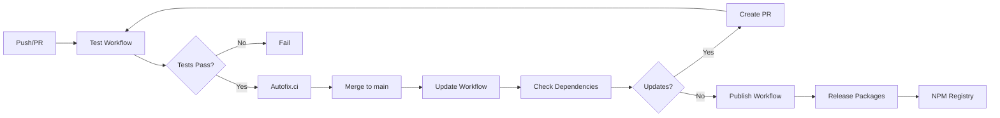

# CI/CD Pipeline

This document explains the CI/CD architecture, workflows, and automation used in the Pulumi Any Terraform project.

## Overview

The project uses **GitHub Actions** for continuous integration and deployment, with three main workflows:

1. **Test Workflow** - Automated quality checks
2. **Update Workflow** - Dependency management
3. **Publish Workflow** - Package publishing

## Workflow Architecture



## Test Workflow

**Trigger**: Every push and pull request  
**File**: `.github/workflows/test.yml`

### Jobs

#### 1. Fix Job

Automatically fixes formatting and linting issues:

```yaml
jobs:
  fix:
    runs-on: ubuntu-latest
    steps:
      - uses: actions/checkout@v5
      - uses: jdx/mise-action@v3
      - run: pnpm install
      - run: pnpm nx affected -t fix
      - uses: autofix-ci/action@v1
```

**What it does**:
- Installs dependencies with pnpm
- Runs formatters (Prettier) on affected packages
- Runs linters (Biome) on affected packages
- Auto-commits fixes via Autofix.ci

#### 2. Lint & Build Job

Validates code quality and builds packages:

```yaml
jobs:
  lint:
    runs-on: ubuntu-latest
    needs: [fix]
    steps:
      - uses: actions/checkout@v5
      - uses: jdx/mise-action@v3
      - run: pnpm install
      - run: pnpm nx affected -t check
```

**What it does**:
- Type checks TypeScript code
- Lints with Biome
- Builds all affected packages
- Validates package.json files
- Checks dependency versions with Syncpack

### Performance Optimizations

- **Nx Affected**: Only processes changed packages
- **Nx Cloud**: Distributed caching for faster builds
- **Concurrent Execution**: Multiple jobs run in parallel

## Update Workflow

**Trigger**: Daily at 00:00 UTC or manual dispatch  
**File**: `.github/workflows/update.yml`

### Purpose

Keeps dependencies up to date automatically:

```yaml
jobs:
  update:
    runs-on: ubuntu-latest
    steps:
      - uses: actions/checkout@v5
      - run: node .github/scripts/check-updates.js
      - run: pnpm install
      - run: pnpm nx run-many -t fix
      - name: Create Pull Request
        # ...
```

**What it does**:
- Checks for dependency updates
- Updates package.json files
- Runs tests and fixes
- Creates automated PR with changes

### Update Strategy

- **Patch versions**: Auto-merge after tests pass
- **Minor versions**: Create PR for review
- **Major versions**: Create PR with breaking change notice

## Publish Workflow

**Trigger**: Push to main branch (after tests pass)  
**File**: `.github/workflows/publish.yml`

### Jobs

#### NPM Package Publishing

Publishes packages to NPM registry:

```yaml
jobs:
  npm-packages:
    runs-on: ubuntu-latest
    permissions:
      id-token: write
      contents: write
      pull-requests: write
    steps:
      - uses: actions/checkout@v5
      - uses: jdx/mise-action@v3
      - run: pnpm install
      - uses: changesets/action@v1
        with:
          publish: pnpm release
        env:
          GITHUB_TOKEN: ${{ secrets.GITHUB_TOKEN }}
          NPM_TOKEN: ${{ secrets.NPM_TOKEN }}
```

**What it does**:
1. Checks for changesets
2. Versions packages based on changesets
3. Builds all packages
4. Publishes to NPM registry
5. Creates Git tags
6. Generates release notes
7. Creates GitHub release

### Version Management

Uses [Changesets](https://github.com/changesets/changesets):

```bash
# Developer creates changeset
pnpm changeset

# CI reads changesets and versions packages
# CI publishes to NPM
# CI creates GitHub release
```

## Security Measures

### 1. Socket Security

Scans dependencies for security issues:

```yaml
- uses: SocketDev/action@v1
  with:
    mode: firewall
```

**Features**:
- Blocks malicious packages
- Detects supply chain attacks
- Monitors network activity
- Validates package integrity

### 2. Dependency Scanning

- **Dependabot**: Automated security updates
- **npm audit**: Vulnerability scanning
- **Syncpack**: Version consistency checks

### 3. Secret Management

```yaml
env:
  GITHUB_TOKEN: ${{ secrets.GITHUB_TOKEN }}
  NPM_TOKEN: ${{ secrets.NPM_TOKEN }}
  NX_KEY: ${{ secrets.NX_KEY }}
```

**Secrets used**:
- `GITHUB_TOKEN`: Repository access
- `NPM_TOKEN`: Package publishing
- `NX_KEY`: Nx Cloud access
- `AWS_*`: S3 cache access

## Caching Strategy

### Nx Cloud Cache

Distributed task caching across CI runs:

```json
{
  "s3": {
    "region": "auto",
    "bucket": "nx-caches",
    "forcePathStyle": true
  }
}
```

**Benefits**:
- Faster builds
- Reduced compute time
- Shared cache across team
- Cost savings

### GitHub Actions Cache

Caches node_modules and build artifacts:

```yaml
- uses: actions/cache@v3
  with:
    path: ~/.pnpm-store
    key: ${{ runner.os }}-pnpm-${{ hashFiles('**/pnpm-lock.yaml') }}
```

## Automated Code Fixes

### Autofix.ci Integration

Automatically fixes and commits:

```yaml
- uses: autofix-ci/action@v1
```

**Fixes**:
- Code formatting (Prettier)
- Linting issues (Biome)
- Package.json formatting
- Import sorting

### Manual Overrides

To skip autofix on a commit:

```bash
git commit -m "feat: new feature [skip autofix]"
```

## Monitoring & Notifications

### GitHub Status Checks

- ✅ Tests pass
- ✅ Build succeeds
- ✅ No linting errors
- ✅ Dependencies secure

### Notifications

- **PR comments**: Test results
- **Slack**: (if configured) Build notifications
- **Email**: Workflow failures

## Local Development Workflow

Simulate CI locally:

```bash
# Run affected checks
pnpm nx affected -t check

# Run affected builds
pnpm nx affected -t build

# Run affected fixes
pnpm nx affected -t fix

# Check all packages
pnpm nx run-many -t check
```

## CI Configuration Files

### mise.toml

Defines tool versions:

```toml
[tools]
node = "22.18.0"
pnpm = "10.14.0"
```

### nx.json

Build orchestration:

```json
{
  "targetDefaults": {
    "build": {
      "dependsOn": ["^build"],
      "cache": true
    }
  }
}
```

### .syncpackrc.json

Dependency management:

```json
{
  "versionGroups": [
    {
      "dependencies": ["@pulumi/pulumi"],
      "policy": "sameRange"
    }
  ]
}
```

## Troubleshooting CI Issues

### Build Failures

1. Check workflow logs in GitHub Actions
2. Reproduce locally: `pnpm nx affected -t build`
3. Clear caches: `pnpm nx reset`
4. Verify Node.js and pnpm versions

### Test Failures

1. Run tests locally: `pnpm nx affected -t check`
2. Check for flaky tests
3. Verify dependencies are installed
4. Review error messages in logs

### Publishing Failures

1. Check NPM token validity
2. Verify package versions
3. Ensure changesets exist
4. Review publish logs

### Cache Issues

1. Clear Nx cache: `pnpm nx reset`
2. Clear GitHub Actions cache (in repository settings)
3. Verify S3 cache credentials

## Best Practices

### 1. Use Changesets

Always create changesets for changes:

```bash
pnpm changeset
```

### 2. Fix Before Commit

Run formatters and linters:

```bash
pnpm nx affected -t fix
```

### 3. Test Locally

Before pushing:

```bash
pnpm nx affected -t check
pnpm nx affected -t build
```

### 4. Keep Workflows Updated

Regularly update GitHub Actions:

```yaml
- uses: actions/checkout@v5  # Use latest
```

### 5. Monitor Build Times

Track and optimize slow builds using Nx Cloud dashboard.

## Metrics & Analytics

### Build Performance

- Average build time
- Cache hit rate
- Test execution time
- Package size

### Deployment Frequency

- Commits per day
- PRs merged per week
- Releases per month
- Update frequency

## Future Enhancements

Planned improvements:

1. **E2E Testing**: Add end-to-end tests
2. **Visual Regression**: Screenshot comparisons
3. **Performance Testing**: Benchmark tests
4. **Documentation Testing**: Link validation
5. **Security Scanning**: Advanced vulnerability detection

## Learn More

<Cards>
  <Card title="GitHub Actions" href="https://docs.github.com/en/actions" description="Learn about GitHub Actions" />
  <Card title="Nx Cloud" href="https://nx.dev/ci/intro/ci-with-nx" description="CI optimization with Nx" />
  <Card title="Changesets" href="https://github.com/changesets/changesets" description="Version management" />
  <Card title="Contributing" href="/docs/contributing" description="Development workflow" />
</Cards>
